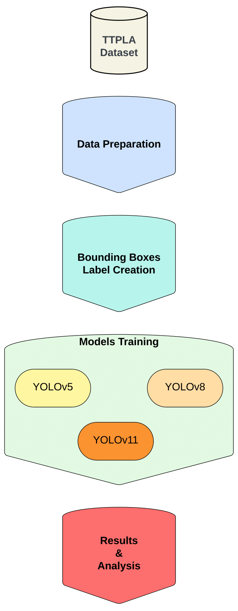
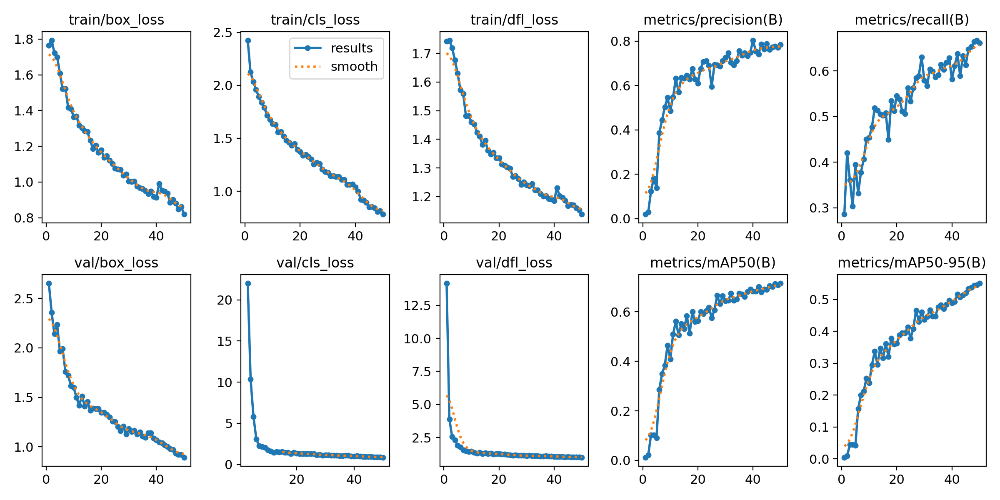

# Evaluating YOLO models in Power Lines Detection using TTPLA Dataset

<!-- <a href="https://doi-org.libpublic3.library.isu.edu/10.1109/ORSS62274.2024.10697949"></a> 
<a href="https://www.researchgate.net/publication/384580344_Evaluating_the_Performance_of_Machine_Learning-Based_Classification_Models_for_IoT_Intrusion_Detection"></a> -->

        

## Abstract
Automated inspection of power grid infrastructure, including wires and transmission towers, is essential for ensuring the safety and reliability of electricity distribution systems. This study evaluates the performance of state-of-the-art object detection algorithms from the YOLO (You Only Look Once) family (YOLOv5, YOLOv8, and YOLOv11) using the Transmission Tower and Power Line Aerial-Image (TTPLA) dataset. The TTPLA dataset, characterized by high-resolution aerial imagery with annotated bounding boxes, presents challenges such as complex backgrounds, diverse object geometries, and class imbalance. Among the models tested, YOLOv8 achieved the highest precision and recall metrics, demonstrating exceptional accuracy in detecting wires and transmission towers under real-world conditions. By leveraging advanced deep learning techniques, addressing class imbalance, and fine-tuning hyperparameters, this work establishes a new benchmark for UAV-based power grid inspections, highlighting the potential of cutting-edge computer vision models in infrastructure monitoring.


## System model
The architecture of our solution is described in the figure below and is divided into four main steps: data acquisition (TTPLA), data preparation, labels creation, models training, and evaluation. 
<br>


### Algorithms used

- **YOLOv5:**  
  This version is lightweight and fast, making it highly suitable for real-time applications such as wire detection. It benefits from extensive community support and a wide range of pre-trained models for easy customization. However, its accuracy is slightly lower compared to newer versions, particularly for detecting thin and intricate objects like wires. It strikes a good balance between speed and performance, focusing on simplicity and ease of deployment.

- **YOLOv8:**  
  Building on its predecessor, YOLOv8 features an improved model architecture and greater accuracy, making it better equipped to detect small or intricate objects such as wires in cluttered environments. It incorporates enhanced backbone networks and optimized training pipelines. Despite these improvements, it demands higher computational resources, which might limit its use on devices with constrained hardware capabilities.

- **YOLOv11:**  
  As the latest iteration, YOLOv11 offers state-of-the-art performance with advanced detection capabilities for complex scenarios, such as detecting dense or overlapping wires. It integrates cutting-edge techniques like transformer-based architectures, improving its ability to capture fine details. However, it requires significant computational power and longer training times, and it has less community support compared to earlier versions, making it a less accessible option for some applications.


## Running the code
<!--To run the code and find the results, please clone this project and download the data. The data path should be the same as the one used in the code. <br> 
`data_training.py` is dedicated for the Machine Learning models and `RL_training.py` for the reinforcement learning implementation. 

### TO NOTE
In the code, We developed models other than the tested models, where we included both Deep Learning (Multilayer Perceptrons (MLP)) models and Reinforcement Learning (DQN) setup.-->
## Results

The main results are illustrated in the table and figure below:
<br>

<br>

### Performance Evaluation of the YOLO Models Compared with Existing Methods

| **Model**        | **Aspect Ratio** | **mAP<sub>50%</sub>** | **mAP<sub>50-95%</sub>** | **Precision (B)** | **Recall (B)** | **Fitness** |
|-------------------|------------------|------------------------|---------------------------|-------------------|---------------|-------------|
| **ResNet-50**     | 700x700          | 42.62                 | 21.90                    | -                 | -             | -           |
|                   | 550x550          | 43.37                 | 20.76                    |                   |               |             |
|                   | 640x360          | **46.72**             | 16.50                    |                   |               |             |
| **ResNet-101**    | 700x700          | 43.19                 | 22.96                    | -                 | -             | -           |
|                   | 550x550          | 45.30                 | 22.61                    |                   |               |             |
|                   | 640x360          | 44.99                 | 18.42                    |                   |               |             |
| **YOLOv5**        | 700x700          | 48.19                 | 33.37                    | 63.19            | **48.51**     | 34.85       |
|                   | 550x550          | 45.34                 | 30.79                    | 59.13            | 46.63         | 32.25       |
|                   | 640x360          | 45.54                 | 31.09                    | 63.41            | 44.49         | 32.53       |
| **YOLOv8**        | 700x700          | **48.23**             | **34.24**                | **64.61**        | 48.26         | **35.63**   |
|                   | 550x550          | **45.93**             | **31.66**                | 60.51            | **47.33**     | **33.09**   |
|                   | 640x360          | 45.45                 | **31.25**                | **64.93**        | 44.43         | **32.67**   |
| **YOLOv11**       | 700x700          | 46.80                 | 32.39                    | 64.30            | 47.33         | 33.83       |
|                   | 550x550          | 44.93                 | 30.91                    | **60.84**        | 45.86         | 32.31       |
|                   | 640x360          | 44.19                 | 29.89                    | 61.49            | 44.09         | 31.32       |


 ## Citation
<!--Please do not hesitate to contribute to this project and cite us:
```
@INPROCEEDINGS{10697949,
  author={Kaddour, Hamza and Das, Shaibal and Bajgai, Rishikesh and Sanchez, Amairanni and Sanchez, Jason and Chiu, Steve C. and Ashour, Ahmed F. and Fouda, Mostafa M.},
  booktitle={2024 IEEE Opportunity Research Scholars Symposium (ORSS)}, 
  title={Evaluating the Performance of Machine Learning-Based Classification Models for IoT Intrusion Detection}, 
  year={2024},
  volume={},
  number={},
  pages={84-87},
  keywords={Machine learning algorithms;Biological system modeling;Ecosystems;Intrusion detection;Smart homes;Predictive models;Data models;Internet of Things;Random forests;Optimization;IoT security;intrusion detection systems;cyber-security threats;IoT networks;malicious intrusions;safeguarding IoT ecosystems},
  doi={10.1109/ORSS62274.2024.10697949}}
```
You can find an extension to this paper where included the DL and RL and comparison in the following [document](https://drive.google.com/file/d/1Z0cyVbdsaaw-EuPd6IidkRskHtIQmqM-/view?usp=sharing). <br> -->
If you find this project interesting, please do not hesitate to reach out to me for any recommendations, questions, or suggestions.
[Email me](mailto:hamzakaddour@isu.edu)
