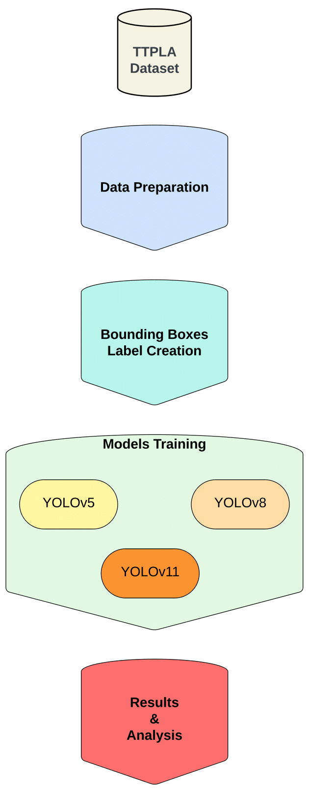
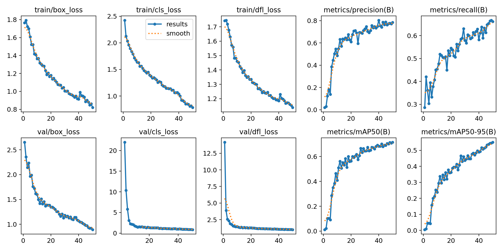

# Power-Line & Transmission-Tower Detection with YOLO

> **Research companion repository:** This repository currently focuses on the methodology, quantitative results, figures, and publication/project context. The full experimental training source code is not included in this public repository.

A comparative computer-vision study evaluating **YOLOv5, YOLOv8, and YOLOv11** for detecting power-grid infrastructure in aerial imagery from the **TTPLA** dataset.

The project focuses on a difficult inspection setting: thin wire structures, complex backgrounds, varying object scale, class imbalance, and the effect of image resolution on detector performance.

## At a glance

| Item | Details |
| --- | --- |
| Task | Object detection in aerial / UAV imagery |
| Dataset | TTPLA — Transmission Tower and Power Line Aerial-Image dataset |
| Models | YOLOv5, YOLOv8, YOLOv11 |
| Resolutions | 700×700, 550×550, 640×360 |
| Best reported configuration | YOLOv8 at 700×700 |
| Best reported mAP50 | **48.23** |
| Best reported mAP50–95 | **34.24** |
| Best reported precision | **64.93** |
| Evaluation | mAP50, mAP50–95, precision, recall, fitness |

## Why this project

Automated inspection of transmission infrastructure can reduce the amount of manual review required for large-scale power-grid monitoring. Aerial imagery is attractive for this task, but wires are visually thin and can be difficult to distinguish from roads, vegetation, shadows, and other linear structures.

This repository compares several YOLO generations and image-resolution choices rather than reporting a single trained detector.

## Pipeline

```text
TTPLA aerial imagery
        |
        v
Dataset preparation
images + annotations
        |
        v
Resolution variants
700x700 / 550x550 / 640x360
        |
        +-----------------------+
        |           |           |
        v           v           v
     YOLOv5      YOLOv8      YOLOv11
        |           |           |
        +-----------+-----------+
                    |
                    v
           quantitative evaluation
      mAP / precision / recall / fitness
```

The project architecture is also illustrated in:



## Results

### YOLO comparison

| Model | Resolution | mAP50 | mAP50–95 | Precision | Recall | Fitness |
| --- | ---: | ---: | ---: | ---: | ---: | ---: |
| YOLOv5 | 700×700 | 48.19 | 33.37 | 63.19 | **48.51** | 34.85 |
| YOLOv5 | 550×550 | 45.34 | 30.79 | 59.13 | 46.63 | 32.25 |
| YOLOv5 | 640×360 | 45.54 | 31.09 | 63.41 | 44.49 | 32.53 |
| **YOLOv8** | **700×700** | **48.23** | **34.24** | 64.61 | 48.26 | **35.63** |
| YOLOv8 | 550×550 | **45.93** | **31.66** | 60.51 | **47.33** | **33.09** |
| YOLOv8 | 640×360 | 45.45 | **31.25** | **64.93** | 44.43 | **32.67** |
| YOLOv11 | 700×700 | 46.80 | 32.39 | 64.30 | 47.33 | 33.83 |
| YOLOv11 | 550×550 | 44.93 | 30.91 | 60.84 | 45.86 | 32.31 |
| YOLOv11 | 640×360 | 44.19 | 29.89 | 61.49 | 44.09 | 31.32 |

The strongest overall result in these experiments was **YOLOv8 at 700×700**, with mAP50 of **48.23**, mAP50–95 of **34.24**, and fitness of **35.63**.

### Training output



## Comparison with previously reported baselines

| Model | Resolution | mAP50 | mAP50–95 |
| --- | ---: | ---: | ---: |
| ResNet-50 | 700×700 | 42.62 | 21.90 |
| ResNet-50 | 550×550 | 43.37 | 20.76 |
| ResNet-50 | 640×360 | 46.72 | 16.50 |
| ResNet-101 | 700×700 | 43.19 | 22.96 |
| ResNet-101 | 550×550 | 45.30 | 22.61 |
| ResNet-101 | 640×360 | 44.99 | 18.42 |

These values are included for comparative context from the project experiments / referenced baseline setup. They should not be interpreted as a universal ranking of detector architectures outside the evaluated data and configurations.

## Engineering considerations

The project highlights several practical computer-vision issues:

- sensitivity of thin-object detection to input resolution;
- comparison of multiple detector generations under similar data conditions;
- evaluation beyond a single metric;
- handling aerial imagery with cluttered backgrounds and highly elongated objects;
- reproducible reporting of model/resolution trade-offs.

## Tech stack

`Python` · `PyTorch` · `YOLOv5` · `YOLOv8` · `YOLOv11` · `OpenCV` · `Pandas` · `Computer Vision` · `Object Detection`

## Dataset attribution

This work uses the TTPLA dataset:

> Abdelfattah, R., Wang, X., & Wang, S. (2020). *TTPLA: An Aerial-Image Dataset for Detection and Segmentation of Transmission Towers and Power Lines*. Asian Conference on Computer Vision.

```bibtex
@inproceedings{abdelfattah2020ttpla,
  title={TTPLA: An Aerial-Image Dataset for Detection and Segmentation of Transmission Towers and Power Lines},
  author={Abdelfattah, Rabab and Wang, Xiaofeng and Wang, Song},
  booktitle={Proceedings of the Asian Conference on Computer Vision},
  year={2020}
}
```

## Portfolio

See the rest of my selected engineering work at:

**https://hamzakaddour.github.io/**
